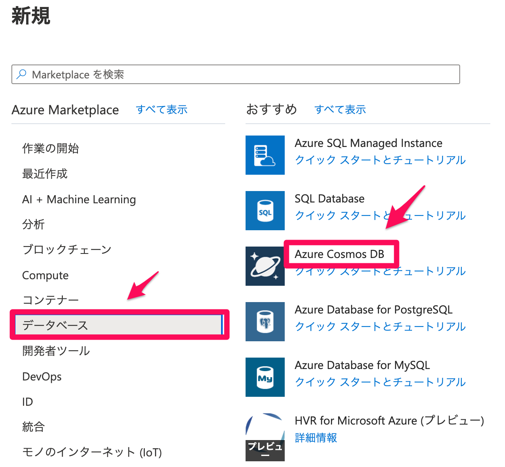
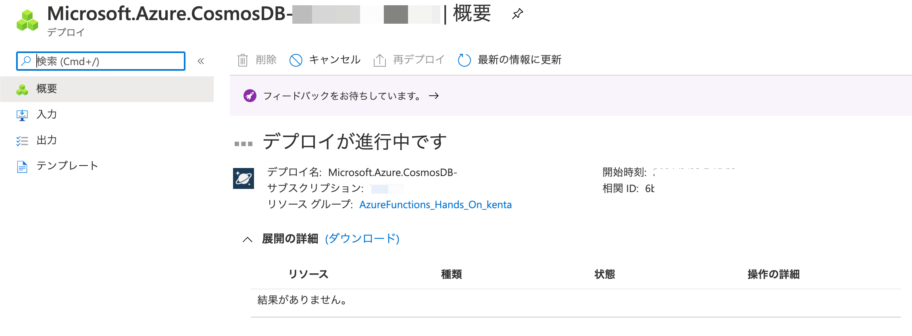
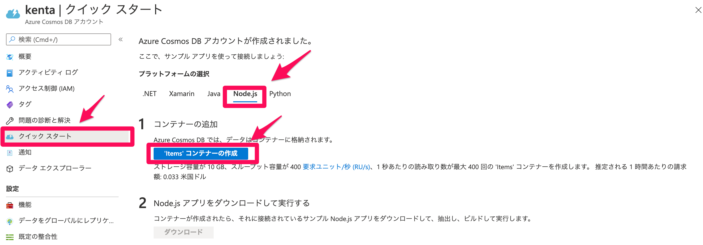
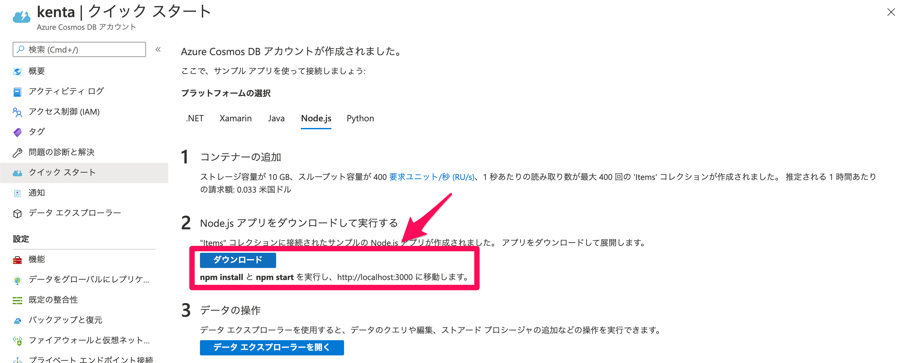
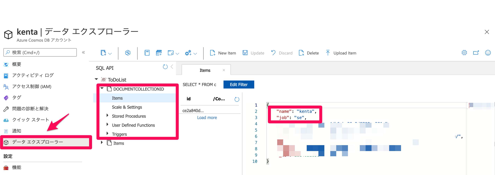

# CosmosDBの作成
## リソースグループの作成
こちらのURLからリソースグループを作成します。

https://portal.azure.com/#blade/HubsExtension/BrowseResourceGroups

表の内容を参考に作成してください。
※XXXXは区別をつけるため名前を使用すると便利です。

| 項目 | 設定内容 |
| -------- | -------- | 
| サブスクリプション     | そのまま     | 
| リソースグループ     | AzureFunctions_Hands_On_XXXX     | 
| リージョン     | Asia Pacific（東日本）     | 

作成」ボタンからリソースグループを作成してください。

## CosmoDBの作成
先ほど作成したリソースグループからCosmosDBを追加して作成してください。



表の内容を参考に作成してください。
※XXXXは区別をつけるため名前を使用すると便利です。

| 項目 | 設定内容 |
| -------- | -------- | 
| サブスクリプション     | そのまま     | 
| リソースグループ     | そのまま     | 
| アカウント名     | XXXX     | 
| API     | コア（SQL)     | 
| 場所     | Asia Pacific（東日本）     | 

そのまま「作成」ボタンからCosmosDBを作成してください。
デプロイに５分ほど時間がかかります。



デプロイ完了後に「リソースに移動」を選択し次に進みます。

## CosmosDBの中身を作成

クイックスタートの手順でDBの中身を作成します。
Node.jsを選択しコンテナを作成


Node.jsアプリからコンテナを作成します。
「ダウンロード」を実施後コマンドを実行する。
その際、以下のファイルを変更して実施ください。


コマンド
```
npm build
npm start
```

config.jsの中身を一部分を変更してください。
今回は項目が分かりやすい名前にしております。
```
~~~~省略
Wakefield: {
    'name':'kenta',
    'job':'SE'
}
~~~~省略
```

CosmosDBにデータが入っているか確認します。
