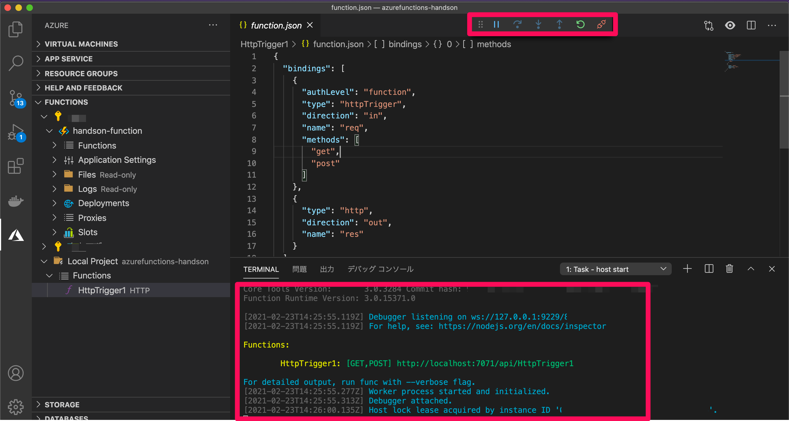

# Functions作成
## Functionsの作成
リソースグループにFunctionsを追加します

表の内容を参考に作成してください

※XXXXは区別をつけるため名前を使用すると便利です

| 項目 | 設定内容 |
| -------- | -------- | 
| サブスクリプション     | そのまま     | 
| リソースグループ     | そのまま     | 
| 関数アプリ名     | handson-function-XXXXX     | 
| 公開     | コード     | 
| ランタイムスタック     | Node.js     | 
| バージョン     | 14    | 
| 地域     | East Asia     | 
| オペレーティングシステム     | Linux     | 

「作成」ボタンからFunctionsを作成してください

## Functionsをローカルで開発する

まずは、VSCodeに拡張機能（Azure Tools）をインストールします


インストール後にAzureのアカウントにログインします


ログインすると、鍵マークになりますのでご確認ください


ローカル環境にFunctionsを作成します
表の内容を参考に作成してください
※XXXXは区別をつけるため名前を使用すると便利です

| 項目 | 設定内容 |
| -------- | -------- | 
| select folder     | 先ほど作成したProject     | 
| select a language     | JavaScript     | 
| select a template     | HTTP Trigger     | 
| function name     | HttpTrigger     | 
| Authorizetion level     | Function     | 

Local ProjectのフォルダができていればOKです


ファイルを見てみるとサンプルのソースコードがダウンロードされています


ローカル環境でデバッグしましょう
VSCode上で「F5」キーを押すとデバッグモードになります


作成したプロジェクトを実行します
画像の内容通りに操作し、実行してください


以下の画像になればOKです


### Functionsにデプロイ
Functionsにローカルで作成した内容をデプロイします
デプロイする内容を選択し、デプロイしてください


表の内容を参考に作成してください

| 項目 | 設定内容 |
| -------- | -------- | 
| select subscription | 自身のサブスクリプションを選択 |
| select function App in Azure | 作成したFunctionName | 

最後に「Deployボタン」を選択してください
Azure Functionsで確認してみましょう


Azure Functions上でもコードテストをしてみましょう


## DBの接続情報を追加する

### 出力形式にCosmosDBを登録する
デプロイしたFuntionsにCosmosDBの接続情報を追加してみましょう

まずは、Functionsの出力方法にDB出力を追加します

作成したFunctionsに「Add binding」から登録します

表の内容を参考に作成してください

| 項目 | 設定内容 |
| -------- | -------- | 
| select binding direction | out |
| select binding direction with outt | Azure Cosmos DB |
| Document parameter name | outputDocument |
| Database name | ToDoList |
| Collection name | DOCUMENTCOLLECTIONID |
| if ture,creates the cosmosdb database and collection | true |
| select setting from local.settings.json | Create new local app setting | 
| select subscription | 今まで使っていたもの |
| select a database account | ToDoList |
| Database name | CosmosDBで作成したNameを選択 |
| Partition key | 空白のままEnter |
| Collection throughput | 空白のままEnter |

function.jsonに選択した項目が追加されているか確認してください


index.jsを以下の通り変更してください
```
module.exports = async function (context, req) {

    context.log(req.query);
    if (req.query.name && req.query.task) {

        context.bindings.outputDocument = req.query;
        context.log(context.bindings.outputDocument);
        context.res = {
            status: 200
        };
    }
    else {
        context.res = {
            status: 400,
            body: "The query options 'name' and 'task' are required."
        };
    }
};
```
再度Functionsにデプロイしてください

### FucntionsにDB接続情報を追加
「設定」→「構成」を選択し新しいアプリケーション設定からlocal.settings.jsonの「XXXX_DOCUMENTDB」を追加してください


Functionsを実行してみましょう
リクエストを以下のように変更して実行してください

| 項目 | 設定内容 |  |
| -------- | -------- | -------- | 
| HTTPメソッド | out | |
| キー | そのまま | |
| クエリ | name | 123456 |
| クエリ | task | 123456 |


[次のSTEP](ReleaseAPI.md)