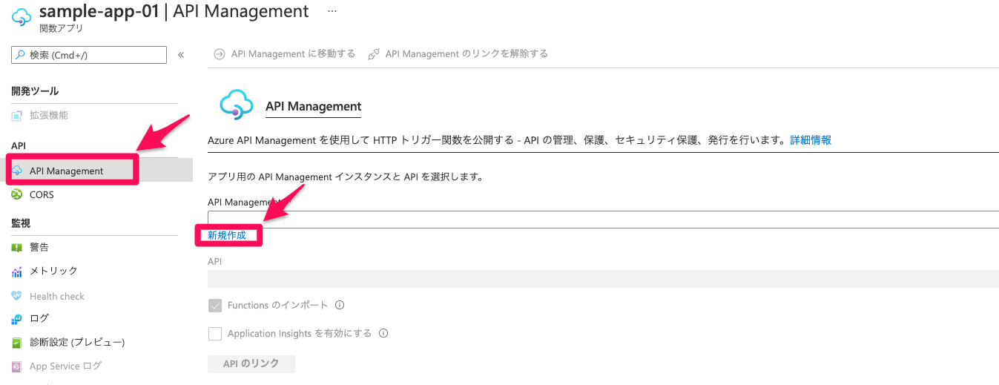

# APIを作成

# API Magagementの作成
API Managementサービスを利用しAPIを作成していきます



表の内容を参考に作成してください

| 項目 | 設定内容 |
| -------- | -------- |
| 名前 | handson-sampleapp-XXXXX | 
| サブスクリプション | そのまま |
| リソースグループ | そのまま |
| 場所 | そのまま |
| 組織名 | 使用している組織名 |
| 管理者のメールアドレス | そのまま |
| 価格レベル | そのまま |

APIManagementにFunctionsAappを追加します

表の内容を参考に作成してください

| 項目 | 設定内容 |
| -------- | -------- |
| Function App | 先ほど作成したFunctions | 
| Display | そのまま |
| Name | そのまま |
| API URL suffix | そのまま |
| Base URL | そのまま |

## APIをテスト
API Managementサービス内でテストを実行します

テストを実行し、DBが更新されていればOKです

## APIを公開
### 製品を作成
「APIs」→「製品」から製品を追加しAPIを公開する準備をします

表の内容を参考に作成してください

| 項目 | 設定内容 |
| -------- | -------- |
| 表示名 | handson-XXXX | 
| ID | 自動入力 |
| 説明 | 適当に |
| 発行済み | チェック |
| サブスクリプションを要求する | チェック |
| 承認が必要 | チェックなし |
| サブスクリプション数の制限 | 空白 |
| 法律条項 | 空白 |
| API | 先ほど作成したAPI |

### サブスクリプションを発行
「APIs」→「サブスクリプション」を作成しAPIを公開する準備をします
表の内容を参考に作成してください

| 項目 | 設定内容 |
| -------- | -------- |
| 名前 | handson-XXXX | 
| 表示名 | handson-XXXX |
| トレースを許可 | チェック |
| スコープ | 製品 |
| 製品 | 先ほど作成した製品 |

作成したサブスクリプションの主キーをメモしてください


### POSTMANで確認
PostmanでAPIへ接続できるか確認しましょう

「ステータス：200」でDBにデータが入っていればOKです

表の内容を参考に作成してください

| 項目 | 設定内容 | |
| -------- | -------- | -------- |
| メソッド | GET | | 
| URL | https://XXXXXX.azure-api.net/sample-app-01/HttpTrigger1?name=api&task=api& | テスト時にURLを使用 | 
| Headers | Ocp-Apim-Subscription-Key | サブスクリプションの主キー | 

## APIにアクセス制限を設ける
作成したAPIにIPアドレスでアクセス制限を付与しアクセスの管理をしていきましょう

「APIs」→「製品」→作成した製品を選択

「製品」→「ポリシー」を以下のコードを参考に編集します
```
<policies>
    <inbound>
        <base />
        <ip-filter action="allow">
            <address>PCのIPアドレスに変更</address>
        </ip-filter>
    </inbound>
   ~~~~省略~~~~
</policies>
```

IPアドレスを変更しアクセスできないことも確認しましょう

Postmanで再度動作確認をし、「ステータス：403」になっていることを確認する
```
{
    "statusCode": 403,
    "message": "Forbidden"
}
```